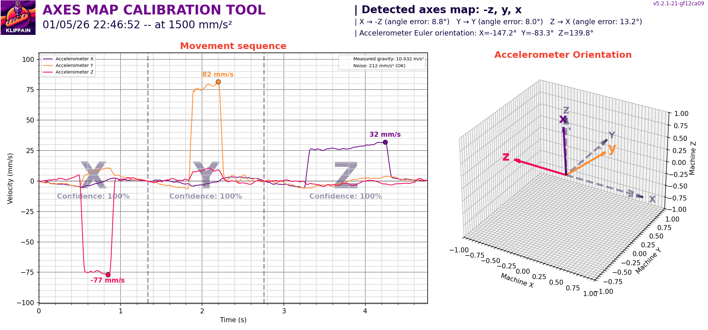
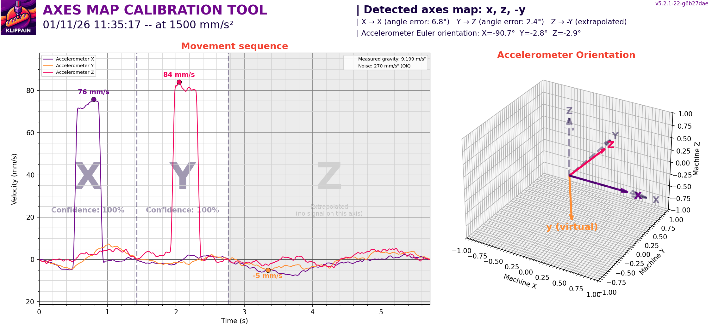
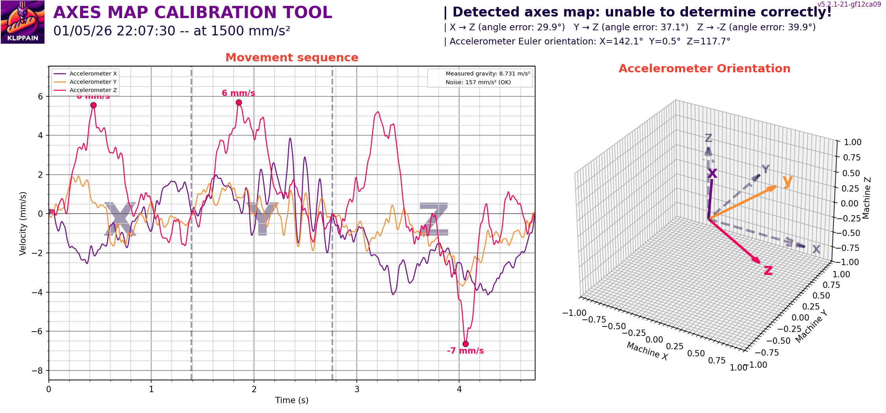

# Accelerometer "axes_map" calibration

All graphs generated by Shake&Tune show plots based on accelerometer measurements, typically labeled with the X, Y, and Z axes. If the accelerometer is rotated, its axes may not align correctly with the machine axes, making the plots more challenging to interpret, analyze, and understand. The `AXES_MAP_CALIBRATION` macro is designed to automatically measure the alignment of the accelerometer in order to set it correctly, making it easier than ever to get the most out of your data!

  > **Note**:
  >
  > This misalignment doesn't affect the accuracy of the measurements because the total sum across all axes is used in most Shake&Tune tools. It's just an optional but convenient way to configure Klipper's `[adxl345]` (or whichever accelerometer you have) "axes_map" parameter.


## Usage

Call the `AXES_MAP_CALIBRATION` macro and look for the graphs in the results folder. Here are the parameters available:

| parameters | default value | description |
|----------:|---------------|-------------|
|Z_HEIGHT|20|z height to put the toolhead before starting the movements. Be careful, if your accelerometer is mounted under the nozzle, increase it to avoid crashing it on the bed of the machine|
|SPEED|80|speed of the toolhead in mm/s for the movements|
|ACCEL|1500|accel in mm/s^2 used for all the moves|
|TRAVEL_SPEED|120|speed in mm/s used for all the travels moves|

  > **Note**:
  >
  > This tool also works on 2-axis machines (Voron Trident, Ender3, Switchwire, etc.) where the accelerometer only moves on 2 axes. See the [2-axis machines](#support-for-2-axis-machines) section for details.



During the measurement, the machine will move slightly in +X, +Y, and +Z. This allows automatic detection of the accelerometer orientation.

Use this value in your `printer.cfg` config file:
```
[adxl345] # replace "adxl345" by your correct accelerometer name
axes_map: -z,y,x
```

## How it works

To detect the accelerometer axes_map, Shake&Tune will move the toolhead on a small straight line in X, then Y, then Z and record the accelerometer data. The algorithm uses a **velocity-based detection** approach that is robust to mechanical vibrations and structural ringing and works like this:
  1. A 25 Hz cutoff filter (low-pass filtering) removes the printer structural ringing while preserving the motion signal (< 30 Hz for typical movements).
  1. Then, instead of directly analyzing acceleration peaks, which can be very noisy, we integrate the filtered acceleration to get the toolhead velocity. This is robust because the peak velocity during a move is unambiguous and integration naturally smooths out oscillations.
  1. For each segment of the sequence, we find which accelerometer axis has the largest peak velocity. That accelerometer axis is the one most aligned with the motion direction. The sign of the peak velocity directly indicates the direction (positive or negative) from the machine axis.
  1. Finally, the algorithm computes two kinds of angles:
    a. per-axis tilt angles that give you the direct 3D angle between the accelerometer's measured vector and the real machine axis
    b. and full Euler angles (roll: X, pitch: Y, and then yaw: Z) to describe the accelerometer orientation in a normalized way. These angles tell you exactly how the accelerometer is tilted relative to the machine frame. For example, "X=2°, Y=-1.5°, Z=0°" means the accelerometer is tilted 2 degrees around X and -1.5 degrees around Y.


## Support for 2-axis machines

Some printer kinematics move the bed instead of the toolhead on certain axes. This means the toolhead-mounted accelerometer doesn't physically move on that axis and only records noise. Here are some printer examples with this kind of kinematics:

| Printer Type | Toolhead axes | Bed axis | Accelerometer detects |
|--------------|---------------|----------|-----------------------|
| Voron 2.4    | X, Y, Z       | -        | X, Y, Z (all)         |
| Voron Trident| X, Y          | Z        | X, Y only             |
| Ender3/Switchwire | X, Z     | Y        | X, Z only             |

| Comment | Example graph |
| --- | --- |
| Shake&Tune automatically detects when exactly one axis has noise-only data. When this happens, the tool will automatically extrapolate the missing direction in order to reconstruct the missing axis using the cross product of the two correctly measured axes and mark this one as "virtual". The resulting axes_map will still be correct and valid for your printer |  |


## Troubleshooting

It can happen that the tool doesn't work for your use case. For example when having this kind of graph result:



When this happens, look at the following table to see if there's a solution for you:

| Error | Cause | Solution |
|-------|-------|----------|
| Same accelerometer axis detected for multiple machine axes | This error means the algorithm couldn't uniquely map each machine axis to a different accelerometer axis. Possible causes range from accelerometer mounted at ~45 degrees between axes to very noisy data making detection unreliable | Remount the accelerometer so it's better aligned with the machine axes, or increase the ACCEL parameter for stronger signals. Additionally, if it doesn't fix it, check your accelerometer wiring and config |
| Low confidence warning | The detection confidence is low, meaning the primary axis peak velocity wasn't much larger than noise or signal on other axes | Increase the ACCEL and SPEED parameters to get stronger velocity signals or check your accelerometer wiring and config |
| High noise level | Too much vibration of the toolhead or high accelerometer noise is present in the data | Check accelerometer wiring, mounting, and ensure the machine is on a stable surface during calibration. Additionally, diagnose your printer mechanical health using the other macros from Shake&Tune to fix any problems |
| High tilt angle warning | The accelerometer is mounted with significant rotation from the machine axes | Klipper doesn't support tilted accelerometers. So, if accuracy matters for your use case, consider remounting the accelerometer aligned with the machine axes. Otherwise, you should expect mixed signals across axes in the other Shake&Tune commands |
| Unusual gravity reading | The measured gravity is not close to 9.81 m/s² | This may indicate an accelerometer calibration issue or a faulty sensor. Check the accelerometer connection and consider replacing it if the issue persists |
